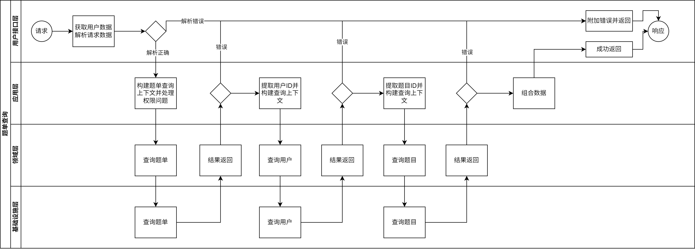

# 后端规范

## 命名规范

### 包名

- 使用小写字母命名。例如：`net/http`、`encoding/json`

### 变量名

- 使用驼峰命名法。例如：`userName`、`totalPrice`

### 函数名

- 使用驼峰命名法。例如：`GetUser`、`CalculateTotal`

## 编码风格

### 书写风格

- 使用4个空格进行缩进。
- 每行代码不超过80个字符。
- 在逻辑块之间使用空行分隔，提高代码可读性。

### 注释规范

- 语言使用简体中文或英语。
- 代码关键处一定要写注释。

### 错误处理

- 使用`error`类型处理错误。
- 为了防止重复处理异常， err 应该被最后一层的调用者处理。
- 如果 err 不会返回到上一层，那就在该层将 err 打印到 log 上。

### 函数

- 一个函数不应该超过一百行代码，如果超过请拆分成多个函数。

### 代码生成器

- 使用了go:generate生成代码
- 在生成代码时，请使用go:generate注释，并使用go generate ./...命令执行。
- 生成的代码应该被git忽略。
- 用于生成代码的文件都应在utils/gen下

---
# 层次架构

- 整体风格参照DDD模式，分层的目的是为了提高代码的可维护性和可扩展性，但是不做严格限制。

## 层次

### 基础设施层

- entity:包含数据库实体定义。
- dao:由dao_store.go生成的包，用于操作数据库。
    - 查询操作返回map[string]any，保证扩展性。
    - 类查询操作（查询、更新、删除等需要用到查询的操作）的输入参数统一为查询上下文。
- option:数据库的查询上下文定义。
- querycontext:根据各个数据库实体定义的查询上下文。
- field:由field_select.go生成的包，用于声明每一个实体所拥有的字段，用于查询、更新时调用。
- query:定义一些快捷调用的查询字段。
- model:定义一些比较杂的数据结构。
- errors:自定义错误，由领域层以上使用，用于在用户接口层附加到请求上下文中，由error_handler进行处理。
- external:定义外部调用。
- bootstrap:启动服务时的初始化操作。
- conf:配置相关。

### 领域层

- 含有各个领域的操作代码，以实体或其他操作（代码评测、图片操作等）为单位定义领域。
- valueobject:值对象，含有创建、校验等操作。
- 领域对象:以数据库实体为基础的领域对象会包含校验、创建、更新、删除等函数；其他操作会包含该领域的接口定义，以及实现该接口的结构体（例：代码评测领域中包含了代码运行接口，并编写了judge0的防腐层实现该接口）。
- 以数据库实体为基础的领域对象拥有由dto_gen.go生成的map[string]any转换到领域对象的方法；拥有由query_gen.go生成的查询方法，会返回领域对象、map[string]any和错误。
- 以数据库实体为基础的领域对象可能会有extra.go定义的跨领域查询上下文方法，用于扩展查询操作（例：在problem中可使用QueryMaxScore方法得到QueryContextOption闭包，用于查询该用户在题目上的最好提交记录；在problem中可使用WhereTag得到QueryContextOption闭包，用于限制查询的题目必须包含所需tagId）。使用例（查询到的map_中将包含该用户的最好提交记录和该题目的tagId）：
```
_, map_, err := problem.Query.SelectOne(problemQuery, problem.QueryMaxScore(reqUser.ID), problem.QueryTag())
```

### 应用层

- dto:定义了用户接口层的请求结构和响应结构。
- service:定义了各个业务的方法，组合各个领域层以实现业务逻辑。
- 查询上下文应在这一层生产，交由领域层消费。

### 用户接口层

- 定义了每一个路由的业务调用，当发生错误时应给上下文附加error（需保证是自定义错误类型），并立即返回。

## 业务案例

### 题单

